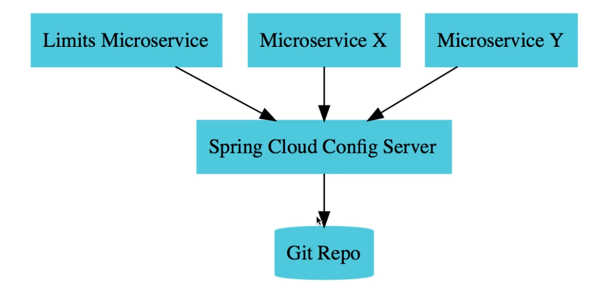
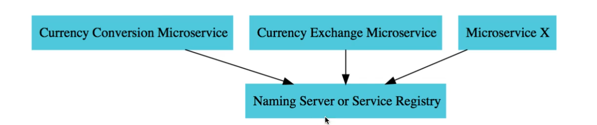
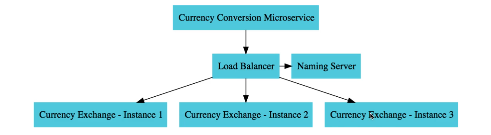
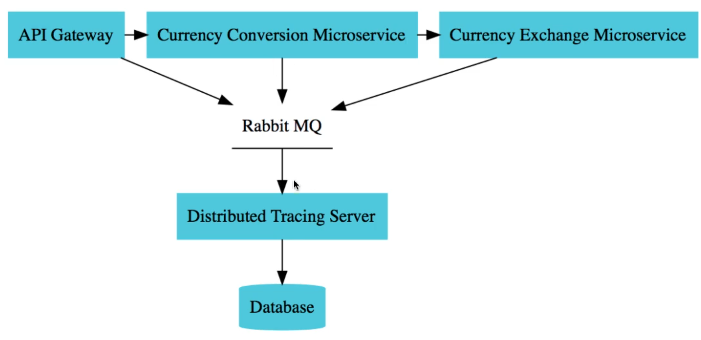
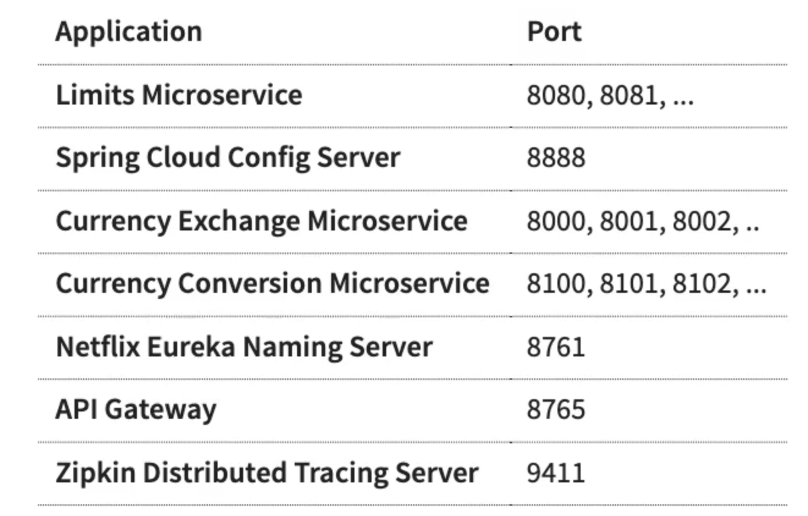

## This is a microservice-based application built with Spring Boot and Spring Cloud. 

### Detailed tech stack:
- Spring Cloud Netflix Eureka Server/Client for service discovery and for balancing the load among the service instances
- Spring Cloud OpenFeign (open-source successor of Netflix Feign) for inter-service communication and load balancing - between the currency and exchange services
- Spring Cloud Config Server for reading configuration profiles stored remotely in a git repository
- Spring Cloud Gateway for routing incoming requests to the appropriate services
- Resilience4j (inspired by Netflix Hystrix) for mechanisms like retry, circuit breaker, rate limiter, bulkhead 
- Zipkin as the implementation of the distributed tracing server for debugging requests among different microservices
- RabbitMQ as a buffer between the distributed tracing server and the other microservices for preventing message loss in case the distributed tracing server is down
- Docker for single-step deployment
- Spring Data JPA for interacting with data
- H2 Database for in-memory database
- Lombok for logging and for eliminating boilerplate POJO coding
- Mapstruct for mapping entities to DTOs and vice-versa

## Purpose
The purpose of this app is to demonstrate the use of the tech stack described above. It's focused on the
technical infrastructure rather than business logic. Therefore, there are no automated tests, but it can be tested manually.  
I included an export for Postman [here](./spring-cloud-microservices-poc.postman_collection.json).

## Start-up:
1. Run `docker-compose up` to start the application. 

All the docker images you need wil be pulled from my personal docker registry https://hub.docker.com/u/eduardn08. If you encounter any problems pulling the images, then run `mvn spring-boot:build-image` for every module (microservice) of the app to build the images locally. Then run `docker-compose up`.

### Naming Server - Eureka
- http://localhost:8761/

### Limits Service
- http://localhost:8080/limits

### API Gateway
- http://localhost:8765/exchange/from/USD/to/EUR
- http://localhost:8765/conversion/from/USD/to/EUR/quantity/10
- http://localhost:8765/conversion-new/from/USD/to/EUR/quantity/10

### Currency Exchange Service - bypassing gateway
- http://localhost:8000/exchange/from/USD/to/EUR

### Currency Conversion Service - bypassing gateway
- http://localhost:8100/conversion/from/USD/to/EUR/quantity/10

### Fault tolerance - Resilience4j:
- http://localhost:8000/sample-api-retry
- http://localhost:8000/sample-api-circuit-breaker - must send multiple requests per second to see effect
- http://localhost:8000/sample-api-rate-limiter - must send multiple requests per second to see effect
- http://localhost:8000/sample-api-bulkhead - must send multiple requests per second to see effect

## Architecture overview

## Ports

RabbitMQ management port: 15672
